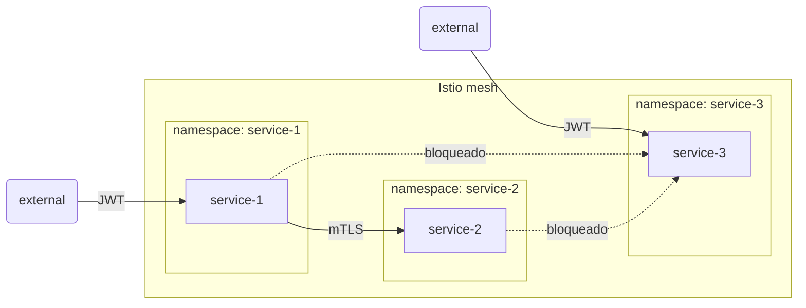

# Desafio Técnico — Pessoa Engenheira DevSecOps (Sênior)

## Contexto

Este desafio avalia sua capacidade de projetar e implementar uma postura de segurança completa sobre uma infraestrutura Kubernetes real. O ambiente usa o mesmo stack que operamos em produção: GKE Standard, Istio self-managed, Infisical para gestão de secrets e Workload Identity para autenticação com GCP.

O foco não é aprender ferramentas — é raciocinar sobre ameaças, tomar decisões de segurança justificadas e implementá-las em múltiplas camadas sobre um stack que você deve conhecer.

## Stack do ambiente

| Camada           | Tecnologia                                                                         |
| ---------------- | ---------------------------------------------------------------------------------- |
| Cluster          | GKE Standard, `RAPID` release channel, `ADVANCED_DATAPATH` (eBPF)                  |
| Service mesh     | Istio upstream (Helm charts `https://istio-release.storage.googleapis.com/charts`) |
| GitOps           | Argo CD                                                                            |
| Secrets          | Infisical self-hosted (chart `infisical-standalone`) + Infisical Secrets Operator  |
| Autenticação GCP | Workload Identity (`GKE_METADATA` mode nos node pools)                             |
| Observabilidade  | Prometheus no namespace `istio-system` com scrape de `istiod` e `envoy-stats`      |
| IaC              | Terraform (backend GCS) + Helm + `kubectl` provider                                |

## Topologia dos serviços



### Serviços base

O candidato deve implementar os três serviços. A implementação é livre — linguagem, framework e base image são escolha do candidato e fazem parte da avaliação.

Contrato obrigatório:

| Serviço     | Porta | Comportamento                                                                                              |
| ----------- | ----- | ---------------------------------------------------------------------------------------------------------- |
| `service-1` | 8080  | `GET /` → `{"service": "1"}`; `GET /upstream` → encaminha requisição para `service-2` e retorna a resposta |
| `service-2` | 8080  | `GET /` → `{"service": "2"}`                                                                               |
| `service-3` | 8080  | `GET /` → `{"service": "3"}`                                                                               |

Todos os serviços devem consumir a variável de ambiente `JWT_SECRET`.

O repositório deve conter dois Dockerfiles na raiz:

- **`Dockerfile`** — imagem de produção, compartilhada pelos três serviços. O serviço a executar é selecionado via variável de ambiente em runtime (ex: `SERVICE=service-1`); o código dos três serviços vive na raiz do repositório. Base image e dependências escolhidas conscientemente pelo candidato.
- **`insecure.Dockerfile`** — imagem deliberadamente insegura, usada exclusivamente para demonstrar que o pipeline de CI detecta e bloqueia uma imagem vulnerável. Deve usar uma base image com CVEs `CRITICAL` conhecidos (ex: `python:3.9`, `node:16`, `ubuntu:18.04`). Não é deployada no cluster.

As decisões de implementação — linguagem, framework, base image do `Dockerfile` — são parte da avaliação. O candidato deve justificá-las no `README.md`.

## Pré-requisito: provisionamento do cluster

Provisionar um cluster GKE usando créditos gratuitos da Google Cloud (`$300` para novos usuários ou o tier gratuito do GKE Autopilot — mas use **Standard** para compatibilidade com o stack abaixo).

A estrutura do Terraform deve seguir o padrão de 4 módulos usado em produção:

```
infra/
├── dependencies.tf   # backend GCS, required_providers
├── providers.tf      # google, kubernetes, helm, kubectl
├── apis.tf           # google_project_service para cada API necessária
├── data.tf           # data sources
├── main.tf           # orquestração dos módulos com depends_on
├── variables.tf      # variáveis de entrada
├── outputs.tf        # outputs
└── modules/
    ├── gke/          # cluster, node pool, VPC, subnets, NAT, firewall
    ├── gcp/          # service accounts, IAM, Cloud Armor, SSL policy
    ├── databases/    # Cloud SQL PostgreSQL (para o Infisical)
    └── deployments/  # Istio, Argo CD, Infisical, Prometheus, os 3 serviços
```

### APIs GCP necessárias

```hcl
compute.googleapis.com
container.googleapis.com
iam.googleapis.com
iamcredentials.googleapis.com
sqladmin.googleapis.com
servicenetworking.googleapis.com
```

## Objetivo

Implementar uma postura de segurança em profundidade (_defense in depth_) sobre o ambiente acima. Cada decisão deve ser justificada por um modelo de ameaças. As implementações técnicas são consequência da análise de riscos, não o contrário.

## Requisitos

### 1. Modelo de ameaças

Antes de qualquer implementação, elaborar `THREAT_MODEL.md` cobrindo:

- **Superfície de ataque**: pontos de entrada externos (JWT, ingress GKE) e internos (lateral movement entre namespaces, acesso ao metadata server GCE, acesso ao API server) — incluindo vetores do stack de produção: Cloud Armor permissivo no ingress e `master_authorized_networks` aberto no API server
- **Atores e vetores**: ao menos um ator externo e um interno, com vetores concretos para esta topologia
- **Ameaças identificadas**: ao menos uma por camada — supply chain, rede, runtime, identidade
- **Controles implementados**: cada controle referencia explicitamente a ameaça que mitiga
- **Riscos residuais**: ao menos um risco não coberto, com justificativa honesta

Este documento é o eixo central da avaliação. Controles implementados sem referência ao modelo perdem metade dos pontos.

### 2. Hardening de runtime

Aplicar hardening nos três namespaces da aplicação:

- **Pod Security Standards** em modo `enforce` no nível `restricted` para todos os namespaces da aplicação
- Todos os containers devem rodar como **não-root**, com **filesystem read-only** e **capabilities dropped** (`drop: [ALL]`)
- **Resource limits** definidos para CPU e memória em todos os pods
- **NetworkPolicy** restringindo ingress e egress de cada namespace ao mínimo necessário (princípio do menor privilégio), complementando as `AuthorizationPolicy` do Istio
- Validar a conformidade com **`kube-bench`** e documentar os resultados, incluindo falhas conhecidas e justificativas para exceções

### 3. Supply chain security

Implementar controles sobre as imagens dos três serviços que o candidato construiu:

- **Scanning de vulnerabilidades** com [Trivy](https://trivy.dev/) — executado sobre o `Dockerfile` de produção; vulnerabilidades `CRITICAL` devem ser corrigidas ou justificadas. O `insecure.Dockerfile` deve ser usado para demonstrar que o pipeline detecta e bloqueia uma imagem com CVE `CRITICAL` conhecido
- **Assinatura de imagens** com [Cosign](https://docs.sigstore.dev/cosign/overview/) usando chave gerada pelo candidato — a chave privada deve ser gerenciada via solução de secrets escolhida na seção 6, não em plaintext no repositório

### 4. Pipeline de segurança

Criar um pipeline de CI (GitHub Actions ou equivalente) com os seguintes gates **bloqueantes**:

- **Secret detection**: [Gitleaks](https://github.com/gitleaks/gitleaks) — falha se encontrar credenciais no histórico git ou nos arquivos
- **IaC scanning**: [Checkov](https://www.checkov.io/) ou [Trivy](https://trivy.dev/) — falha em misconfigurations críticas nos manifestos YAML ou no Terraform
- **Image scanning**: Trivy sobre o `insecure.Dockerfile` — falha obrigatória em CVE `CRITICAL`; Trivy sobre o `Dockerfile` de produção — falha apenas se houver CVE `CRITICAL` sem justificativa documentada

Gates que apenas geram relatórios sem falhar o pipeline não são aceitos.

### 5. GitOps com Argo CD

Instalar **Argo CD** no cluster e configurar o repositório como fonte única de verdade para os três serviços:

- Argo CD deve ser o único mecanismo de deploy dos serviços no cluster — `kubectl apply` direto não é uma operação válida em produção
- Os manifestos dos três serviços devem ser gerenciados por `Application` resources do Argo CD, apontando para o repositório Git
- O pipeline de CI deve ser o único caminho para atualizar os manifestos na branch principal — Argo CD sincroniza a partir daí
- Demonstrar que uma alteração no repositório (ex: atualização de imagem) se propaga ao cluster exclusivamente via Argo CD

### 6. Detecção de ameaças em runtime

Instalar [**Falco**](https://falco.org/) no cluster e configurar regras customizadas:

- Execução de shell dentro de qualquer container da aplicação (`exec` de `sh`, `bash`, etc.)
- Leitura de arquivos sensíveis do sistema (`/etc/passwd`, `/etc/shadow`, `/proc/*/environ`)
- Tentativa de escrita em filesystem marcado como read-only
- Conexão de rede originada de dentro de um container para destinos fora da malha Istio

Demonstrar ao menos dois alertas disparados por ações deliberadas (ex: `kubectl exec` para abrir um shell).

### 7. Gestão de secrets

Implementar uma solução de gestão de secrets para os seguintes itens — nenhum deles em plaintext no repositório:

- A variável de ambiente `JWT_SECRET` consumida pelos três serviços
- A chave privada Cosign usada para assinar as imagens

A escolha da solução é livre — Infisical, Vault, GCP Secret Manager, External Secrets Operator, ou qualquer outra — desde que justificada no `README.md`. A justificativa deve cobrir: por que esta solução foi escolhida, quais são seus trade-offs em relação às alternativas, e como ela se integraria ao stack de produção da organização (que usa Infisical self-hosted).

Os pods devem consumir secrets via integração com o backend escolhido — não via `Secret` Kubernetes com valores hardcoded no repositório.

Demonstrar que nenhum segredo sensível aparece em plaintext no repositório git, nos manifestos commitados ou nos logs do cluster.

### 8. Documentação

Incluir no repositório:

- **`THREAT_MODEL.md`**: modelo de ameaças conforme seção 1
- **`README.md`** com:
  - Arquitetura de segurança completa por camada
  - Passo a passo reproduzível do zero (assumindo conta GCP com créditos, sem configuração prévia)
  - Comandos de validação para cada controle de segurança
  - Justificativa de todas as decisões não triviais
  - Análise crítica: o que ficou de fora e por quê

## Critérios de avaliação

| Critério                                                          | Peso  |
| ----------------------------------------------------------------- | ----- |
| Modelo de ameaças coerente, específico para esta topologia        | Alto  |
| Coerência entre modelo de ameaças e controles implementados       | Alto  |
| Hardening de runtime (PSS, read-only FS, no-root, NetworkPolicy)  | Alto  |
| Supply chain (Trivy, Cosign)                                      | Alto  |
| Pipeline de CI com gates bloqueantes                              | Alto  |
| GitOps com Argo CD como único mecanismo de deploy                 | Alto  |
| Falco com regras customizadas e alertas demonstrados              | Alto  |
| Gestão de secrets sem plaintext no repositório                    | Alto  |
| Reprodutibilidade: conseguimos replicar do zero seguindo o README | Alto  |
| Riscos residuais documentados e justificados                      | Alto  |
| Qualidade analítica — profundidade vs. superficialidade           | Alto  |
| Justificativa das escolhas técnicas                               | Médio |
| Organização do repositório e qualidade do IaC                     | Médio |

## O que **não** será avaliado

- Alta disponibilidade do control plane
- Performance ou otimização de recursos
- Quantidade de ferramentas usadas — profundidade vale mais que amplitude
- Serviços GCP além dos listados no stack (Cloud Armor avançado, Binary Authorization, etc.) — são bem-vindos na análise da seção 7, mas não são requisito

## Entrega

Repositório Git (público ou com acesso compartilhado) contendo:

- Terraform do cluster (módulos `gke/`, `gcp/`, `databases/`, `deployments/`)
- Manifestos YAML e/ou `values.yaml` Helm dos controles de segurança
- Regras customizadas do Falco
- Pipeline de CI (`.github/workflows/`, `.gitlab-ci.yml`, etc.)
- `THREAT_MODEL.md`
- `README.md` com toda a documentação exigida

Não é necessário gravar vídeo ou fazer apresentação.

## Dicas

- Comece pelo modelo de ameaças — ele deve guiar todas as decisões técnicas subsequentes.
- Cada controle implementado deve referenciar explicitamente a ameaça que mitiga no `THREAT_MODEL.md`. Controles sem rastreabilidade ao modelo perdem metade dos pontos.
- NetworkPolicy e `AuthorizationPolicy` do Istio atuam em camadas diferentes (L3/L4 vs L7) e se complementam — não são redundantes.
- Falco no GKE Standard tem acesso normal ao kernel — use o driver padrão (`kmod`) ou `modern_ebpf`.
- `kube-bench` pode ser executado como um Job no próprio cluster: `kubectl apply -f https://raw.githubusercontent.com/aquasecurity/kube-bench/main/job.yaml`.
- Na seção 7, riscos residuais bem documentados e justificados demonstram maturidade — não tente esconder limitações ou fingir que não existem trade-offs.
